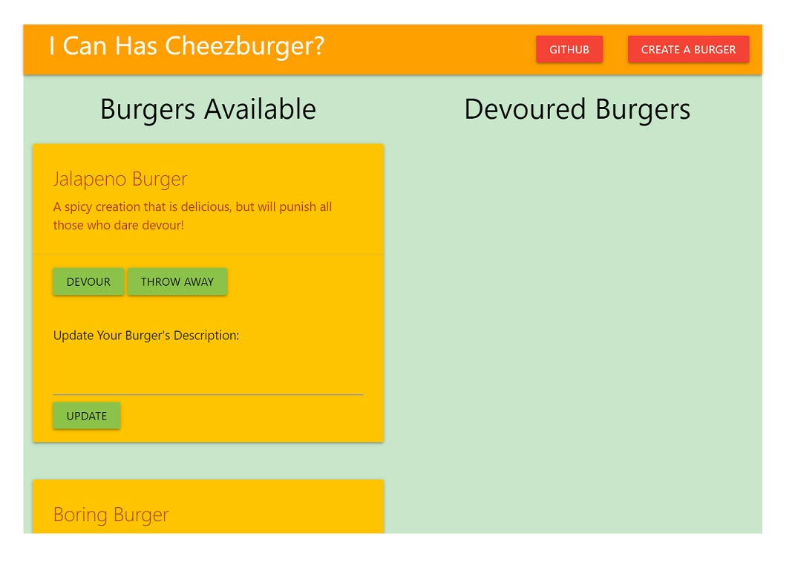

# Burger Builder

#### How To Use:
Click `"Create A Burger"` and type in the name and description for your burger.  You will see your burger on the left and you can choose to either edit it, or "devour" (delete) it.  This app was created to practice communicating with a database, SQL in this case, and features an Express based server hosted on Heroku.

[See it Live](https://pure-sierra-96038.herokuapp.com/)

#### Getting Started:
HTTPS:   `$ Git Clone https://github.com/akaryrye/Burger.git`

SSH:   `$ Git Clone git@github.com:akaryrye/Burger.git`

`npm install` to install dependencies

`npm start` to start server

#### Technologies:
HTML, CSS, Handlebars, Sequelize, SQL, Express, jQuery

#### Author:
Ryan K Alldrin

Thank you and I hope you enjoyed this app!
